# README 报告
## 配置 C++ 开发环境
**流程**：在vscode下载 C++ 插件后按照其教程配置
## 安装 OpenCV 库
**流程**：按照任务书进行配置  
**报错**：（此处忘记保留截图，其大概报错显示为：*E: failed to fetch...* ）  
**问题来源以及解决措施**：原本使用的清华源有问题，换源之后立刻解决
## 组织项目结构
**流程**：按照第一次任务书的 ubuntu 基本终端操作进行组织配置
## 实现基础图像处理操作与运行
**CMakeLists.txt 编写**：直接 cv 任务书  
**主程序开发**：大部分借助 GPT 完成
## 项目构建与运行
**流程**：参考任务书
## 生成图片
+ 图像颜色空间转换:
  + 灰度图
    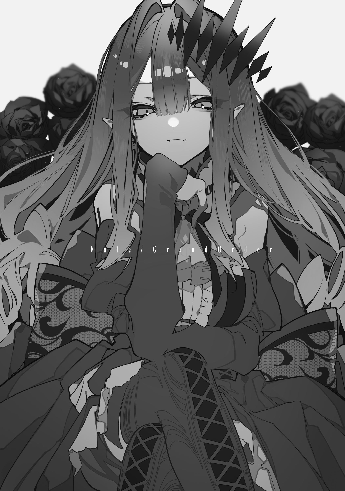
  + HSV图片
    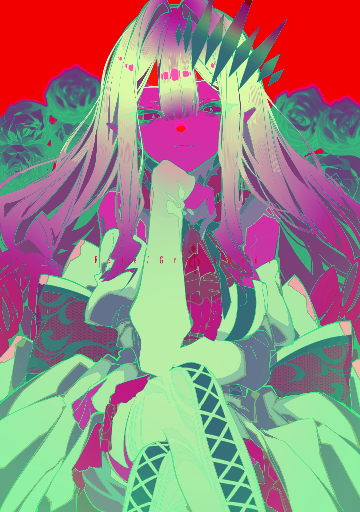
+ 应用各种滤波操作：
  + 均值滤波
    
  + 高斯滤波
    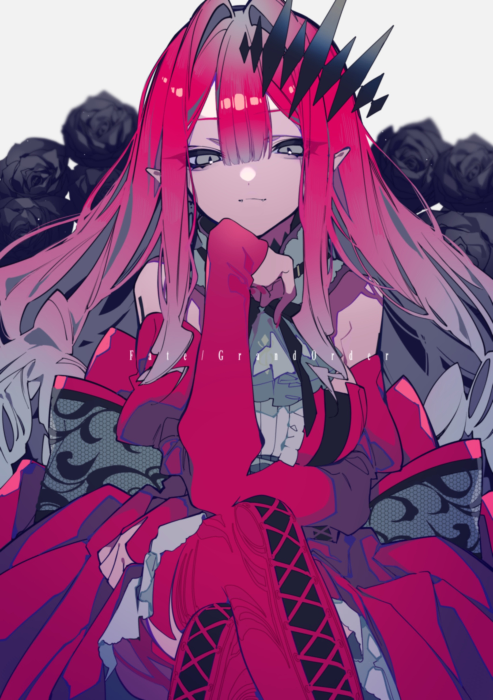
+ 特征提取
  + 提取红色颜色区域
    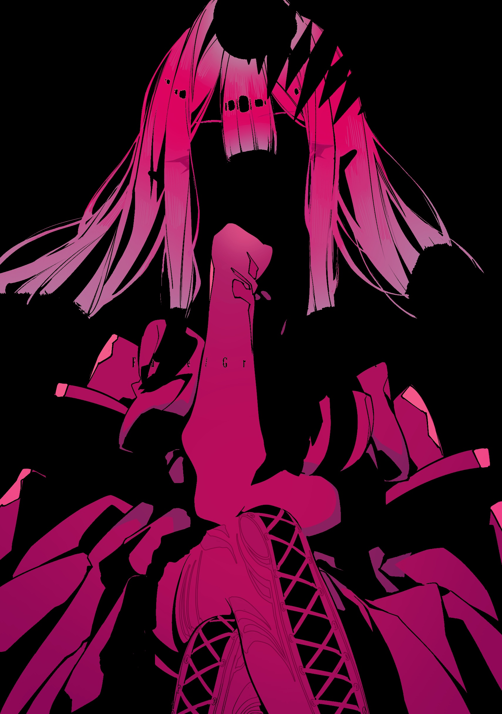
  + 寻找红色外轮廓
    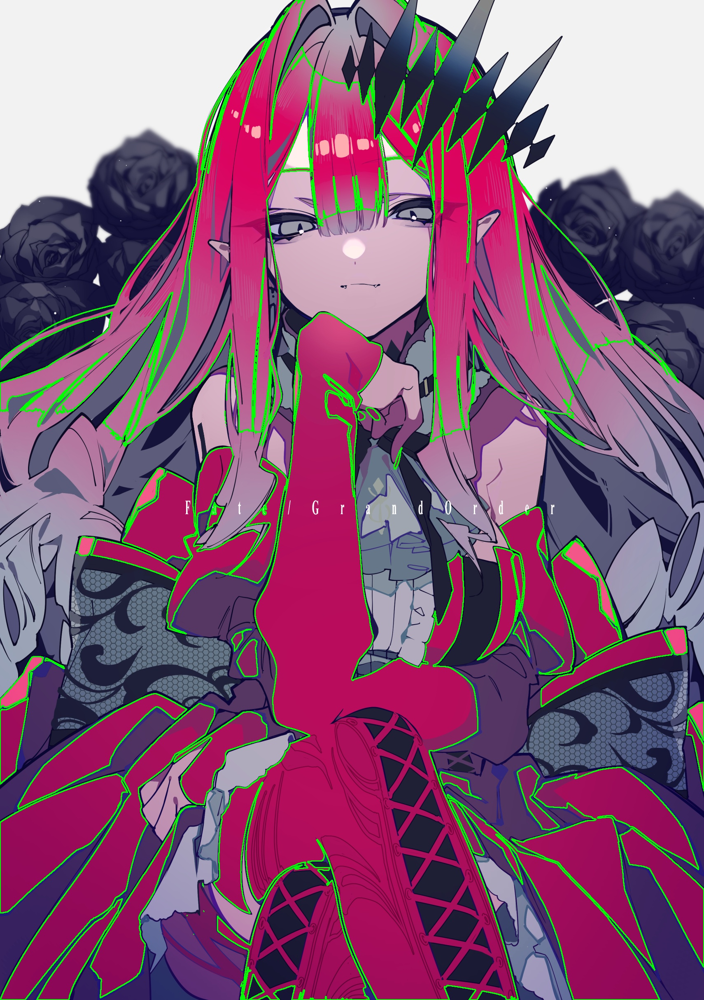
  + 寻找红色bounding_box
    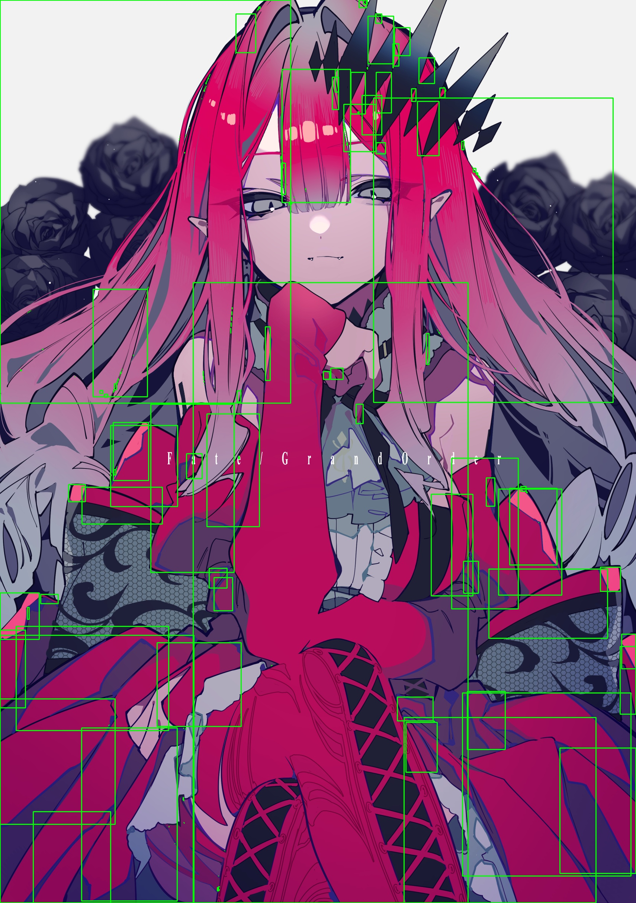
  + 提取高亮颜色区域并进行图形学处理
    + 二值化
        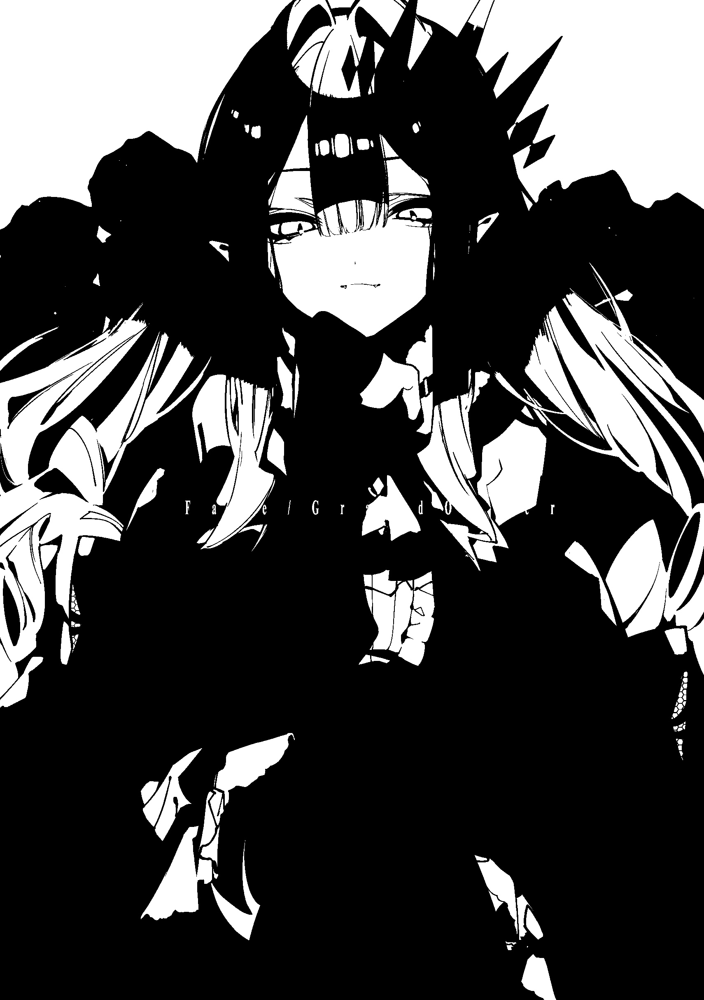
    + 膨胀
        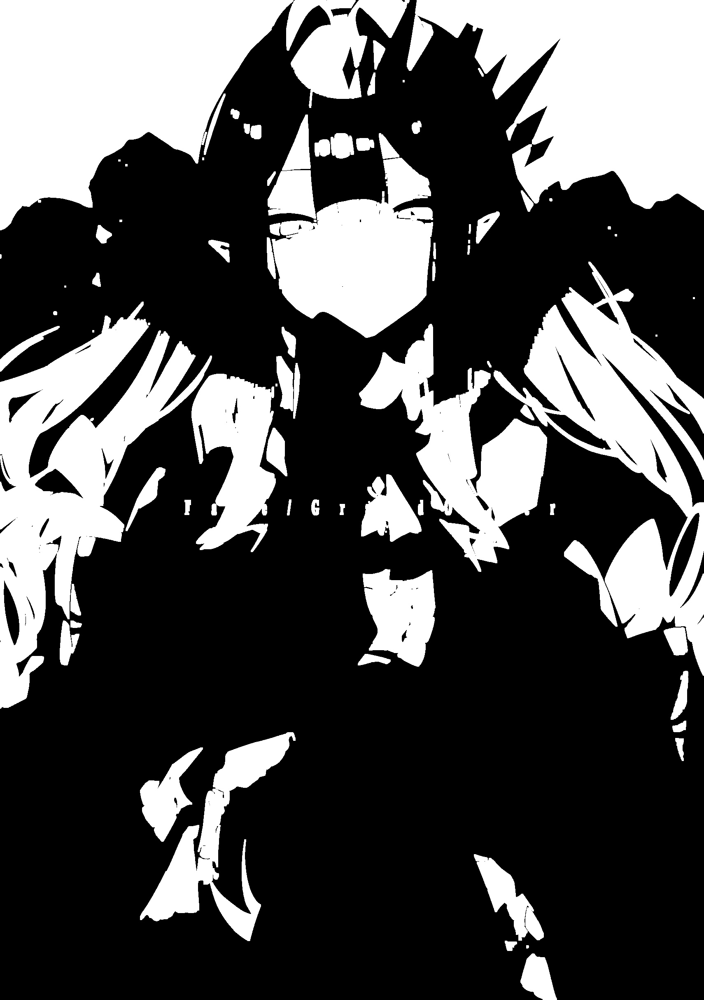
    + 腐蚀
        
    + 漫水处理
        
  + 图像绘制
    + 绘制圆形方形和文字
        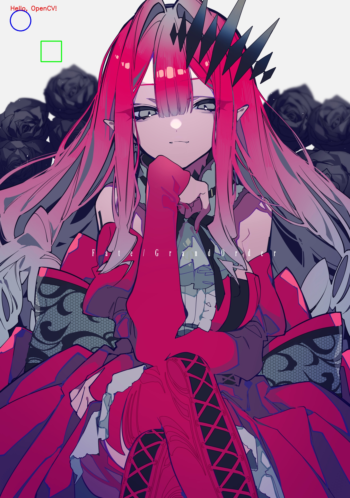
    + 图像处理
      + 旋转35度
        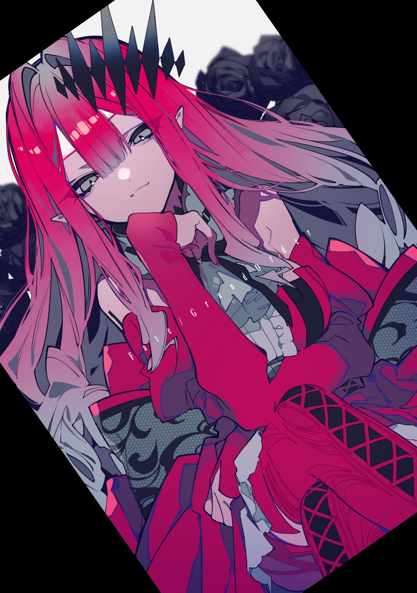
      + 裁剪为左上角1/4
        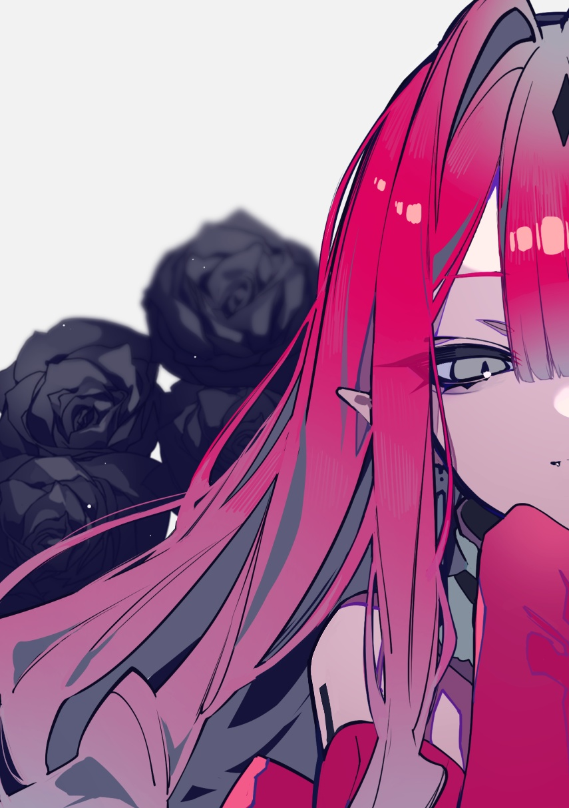
+ 终端
    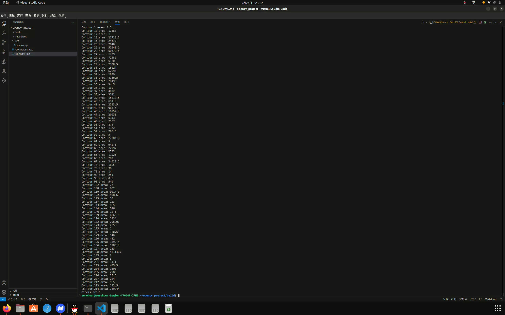
